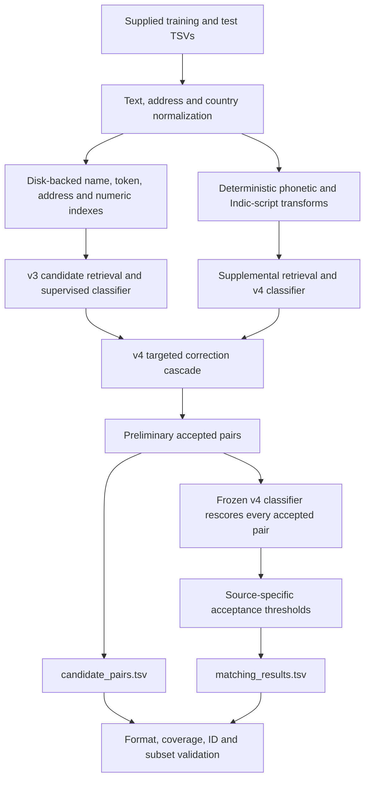

<div align="center">

# Chakravyuh

### Business Entity Resolution · Amazon ML Challenge

**Resolve noisy business identities across three independent sources.**

[](code/business_entity_resolution/README.md)
[](code/business_entity_resolution/requirements.txt)
[](LICENSE)
[](Documentation_template.md)
[](code/business_entity_resolution/reports_v7/metrics.json)

[Quick start](#quick-start) · [Architecture](#architecture) · [Results](#results) · [Reproduction](#reproduce-the-complete-pipeline) · [Methodology](Documentation_template.md)

</div>

---

## Overview

Business records often describe the same company with different spellings,
abbreviations, scripts or incomplete addresses. This project links a deduplicated
Source 1 reference to zero, one or many matching records from Sources 2 and 3.

The solution combines disk-backed candidate retrieval, supervised LightGBM
classifiers, deterministic phonetic and script normalization, and a conservative
final pair-scoring stage. It trains from the supplied challenge labels and produces
both the final matches and the exact candidate inputs to the last classifier.

> **Result context:** The badge reports independent **offline validation**, not
> a leaderboard score. The final v7 leaderboard score has not been supplied.
> France appears only in test data, so its accuracy is not measured by this holdout.

## At a glance

| Item | Completed v7 solution |
| :--- | :--- |
| Reference entities in test | **1,732,544** |
| Pairs scored by the final classifier | **5,702,473** |
| Accepted test matches | **5,641,306** |
| Test references predicted with no matches | **105,433** |
| France reference entities included | **259,452** |
| Final pair features | **154** |
| Final acceptance thresholds | Source 2: **0.65** · Source 3: **0.75** |
| Independent assessment | **10,000** held-out reference entities |
| Model family | LightGBM tree classifiers trained from scratch |
| Runtime | CPU-based; no GPU required |

Counts are recorded in [prediction statistics](code/business_entity_resolution/reports_v7/prediction_stats.json)
and [complete output validation](code/business_entity_resolution/reports_v7/validation_streaming.log).

## Architecture



### What the pipeline does

1. **Normalize records.** Handle Unicode accents, punctuation, legal suffixes,
   abbreviations and address tokens while retaining complementary representations.
2. **Retrieve candidates.** Search disk-backed indexes using multiple name,
   address, numeric and phonetic keys. Block-size limits and ranked caps control
   candidate volume; their missed matches count against measured recall.
3. **Train supervised classifiers.** Learn from name/address similarities,
   token rarity, uniqueness, numerical order and competing-reference evidence.
4. **Apply targeted corrections.** The v4 gate selects references that need
   additional cross-script evidence; other references retain v3 predictions.
5. **Rescore preliminary positives.** The v7 final stage applies the frozen
   154-feature v4 model to every v4-accepted pair, with separate Source 2/3 thresholds.
6. **Export and validate.** Produce one row for every test reference, including
   empty predictions and unseen country labels.

**Candidate audit:** The v7 candidate file contains exactly the preliminary
positive pairs scored by the final classifier. Earlier, broader retrieval pools
are intermediate stages. Every exported final match is a member of its candidate list.

## Results

Both approaches below are evaluated on the **same fresh 10,000-reference sample**,
excluded from every earlier model-fitting and development sample.

| Metric | v4 baseline | Final v7 |
| :--- | ---: | ---: |
| Entity-level macro-F0.5 | 0.972876 | **0.974017** |
| Pair precision | 0.991229 | **0.994875** |
| Pair recall | **0.946350** | 0.941644 |
| False-positive pairs | 290 | **168** |
| False-negative pairs | **1,858** | 2,021 |
| Correctly identified singletons | 535 / 553 | **541 / 553** |

The mean paired macro-F0.5 improvement is **0.00114088**, with an approximate
95% confidence interval of **[0.00035803, 0.00192374]**. The final stage improves
precision while sacrificing some recall.

Thresholds were selected on **30,000 separate development references**, then
frozen before the independent assessment. Full numerical evidence is in
[metrics.json](code/business_entity_resolution/reports_v7/metrics.json) and
[development.json](code/business_entity_resolution/reports_v7/development.json).
The participant reported a **0.962 public score for v4**; that is a different
evaluation from the offline results above.

### Scoring

For an entity with true matches, the challenge computes:

```text
F0.5 = 1.25 × TP / (0.25 × number_of_true_matches + number_of_predicted_matches)
```

Scores are averaged across Source 1 entities. A true singleton receives **1**
for an empty prediction and **0** for any predicted match. References with true
matches but no predicted matches receive **0**. Pair precision and recall in
the results table are separate micro-level diagnostics.

## Dataset

The challenge dataset must be obtained separately. It is not distributed in this
repository. Read every file with an explicit **tab separator**.

```text
dataset/
├── train/
│   ├── train_source1.tsv
│   ├── train_source2.tsv
│   ├── train_source3.tsv
│   └── train_ground_truth.tsv
└── test/
    ├── test_source1.tsv
    ├── test_source2.tsv
    └── test_source3.tsv
```

| Source | Training records | Test records |
| :--- | ---: | ---: |
| Source 1 — deduplicated reference | 2,206,821 | 1,732,544 |
| Source 2 — target records | 5,034,616 | 4,887,273 |
| Source 3 — target records | 5,285,603 | 5,082,316 |

Record fields: `entity_id`, `business_name`, `business_address`, `country`.
Ground-truth fields: `source1_entity_id`, `matched_entity_ids`.
Training countries are US and India; test additionally contains France.
Country is handled as an open string, without a fixed country vocabulary.
See the [dataset inventory](code/business_entity_resolution/reports/data_inventory.json)
for counts, missing fields and input hashes.

## Quick start

The commands below use **PowerShell on Windows**. The tested Python version is
**3.13.3**. Run the clone command once, or use an existing checkout.

```powershell
git clone https://github.com/SaiShashank-10/Amz_ML.git
cd Amz_ML\code\business_entity_resolution

python -m venv .venv
.\.venv\Scripts\python.exe -m pip install -r .\requirements.txt
```

<details>
<summary><strong>Pinned dependency versions</strong></summary>

| Dependency | Version |
| :--- | :--- |
| LightGBM | 4.7.0 |
| NumPy | 2.2.6 |
| SciPy | 1.16.0 |
| scikit-learn | 1.7.2 |
| RapidFuzz | 3.14.6 |
| xxhash | 3.5.0 |
| joblib | 1.5.1 |
| threadpoolctl | 3.6.0 |

The authoritative environment file is [requirements.txt](code/business_entity_resolution/requirements.txt).

</details>

## Reproduce the complete pipeline

From `code/business_entity_resolution/`, set your input data location and a
**new or empty** work directory:

```powershell
$datasetPath = "C:\path\to\student_resource\dataset"
$runPath = "C:\path\to\fresh_v7_reproduction"

.\.venv\Scripts\python.exe -u .\src\reproduce_submission.py --data-dir "$datasetPath" --work-root "$runPath" --workers 4
```

This runs actual training, development threshold selection, independent offline
assessment, full test prediction and validation. It writes:

```text
fresh_v7_reproduction/
├── artifacts/                 # baseline indexes, sample and model
├── artifacts_v3/              # v3 training, context and inference
├── artifacts_v4/              # v4 training and correction cascade
├── artifacts_v5/              # development assessment caches
├── artifacts_v7/              # final policy, assessment and rescoring
├── output/
│   ├── matching_results.tsv
│   └── candidate_pairs.tsv
└── reproduction_hashes.json
```

To preview all **14 ordered stages** without training:

```powershell
.\.venv\Scripts\python.exe .\src\reproduce_submission.py --data-dir "$datasetPath" --work-root "$runPath" --workers 4 --dry-run
```

### Training and assessment separation

| Stage | Reference sample | Purpose |
| :--- | ---: | :--- |
| Original baseline | 30,000 | Fit, tune and assess the initial classifier |
| v3 | 60,000, excluding baseline sample | Fit, tune and assess enhanced features |
| v4 | 60,000, excluding earlier model samples | Fit, tune and assess phonetic/numeric corrections |
| v7 development | 30,000 further references | Select final source thresholds |
| v7 fresh assessment | 10,000 further references | Evaluate the frozen final policy |

Training is **sampled supervised fitting**, not fitting on every labeled reference.
Candidate retrieval searches the full supplied target populations. The two ordered
development sampling calls—first 10,000, then 30,000—use distinct fixed seeds.
The runner preserves that order and requires a positive paired-assessment gain
before final production.

### Runtime and progress

- CPU execution can take **many hours**, depending on processor, memory and disk.
- Four workers are the conservative configuration used with a 16 GB machine;
  large feature matrices may require a pagefile.
- Allow at least **45 GB of free disk beyond input data**, with additional headroom
  for intermediate stages. The complete historical local workspace was about 67 GB.
- The runner prints each stage's log location. Do not run simultaneous jobs in
  the same work directory.

```powershell
Get-Content "$runPath\artifacts_v7\finish.log" -Tail 20 -Wait
```

Use the log for the currently active stage. The top-level runner rejects nonempty
work directories; individual inference modules support checkpoint reuse under
their model/input manifests. To resume a failed stage, inspect its log and use
the corresponding command printed by `--dry-run`.

## Validate outputs and run tests

From `code/business_entity_resolution/`, using the variables defined above:

```powershell
# Validate BOTH generated files, including every target ID.
.\.venv\Scripts\python.exe .\src\validate_streaming.py --output-dir "$runPath\output" --test-dir "$datasetPath\test"

# Also run the original challenge validator on the matching file.
.\.venv\Scripts\python.exe .\src\validate_submission.py --matching "$runPath\output\matching_results.tsv" --test-dir "$datasetPath\test" --check-ids

# Baseline normalization, metric and candidate-consistency tests.
.\.venv\Scripts\python.exe -m unittest discover -s .\src -p test_pipeline.py

# Read the completed independent assessment included in this repository.
Get-Content .\reports_v7\metrics.json
```

Streaming validation checks exact headers, full reference coverage, existing
target IDs, source prefixes, duplicate-free rows/lists and match inclusion in
candidates. The official matching-only check is run from the code directory to
avoid its automatic loading of a large candidate file. The streaming check
independently validates both files. Validators assess submission correctness,
not accuracy without labels.

## Output contract

| File | Exact columns |
| :--- | :--- |
| `matching_results.tsv` | `source1_entity_id`, `matched_entity_ids` |
| `candidate_pairs.tsv` | `source1_entity_id`, `candidate_entity_ids` |

Both are tab-separated, with one row per test Source 1 entity. Target ID lists
are comma-separated, contain only valid Source 2/3 IDs, and have no duplicates.
An empty second field represents no matches or no candidates. Matching permits
zero, one or many targets; no forced one-to-one assignment is imposed.

The final competition ZIP uses this layout:

```text
Chakravyuh_submission.zip
├── output/
│   ├── matching_results.tsv
│   └── candidate_pairs.tsv
├── code/
│   └── business_entity_resolution/
│       ├── src/
│       ├── README.md
│       ├── requirements.txt
│       └── ...               # models, reports and license notices
└── Documentation_template.md
```

The completed local archive also includes a SHA-256 manifest. Large outputs
and the submission archive are intentionally absent from the GitHub checkout;
they remain locally and can be regenerated from the supplied data.

## Repository map

```text
Amz_ML/
├── README.md
├── Documentation_template.md
├── LICENSE
├── REQUIREMENTS_AUDIT.md
├── FINAL_SUBMISSION_STATUS.json
└── code/business_entity_resolution/
    ├── src/                  # pipeline, stage runners and validators
    ├── models/               # original baseline model
    ├── models_v3/            # enhanced models
    ├── models_v4/            # phonetic model used by final v7 rescoring
    ├── reports/              # data inventory and baseline evidence
    ├── reports_v3/
    ├── reports_v4/
    ├── reports_v7/            # final policy, metrics and validation
    ├── licenses/
    ├── README.md             # detailed execution reference
    ├── requirements.txt
    └── LICENSE
```

| Entry point | Responsibility |
| :--- | :--- |
| `reproduce_submission.py` | End-to-end ordered reproduction |
| `pipeline.py` | Baseline normalization, retrieval and supervised learning |
| `enhanced_pipeline.py` | v3 retrieval and population/context features |
| `phonetic_features.py`, `phonetic_index.py`, `phonetic_pipeline.py` | Deterministic script transforms, supplemental retrieval and v4 training |
| `hybrid_pipeline.py` | Targeted v4 correction cascade |
| `empty_recovery.py` | Development/fresh baseline assessment caches |
| `match_rescore.py`, `calibrate_rescore.py`, `finish_rescore.py` | Final pair scoring, threshold calibration and output assembly |
| `validate_streaming.py`, `validate_submission.py` | Complete-output and official format validation |

Historical experiment scripts remain for audit. The rejected v5 recovery and
v6 ambiguity policies are **not applied** to the final submitted predictions.
No separate v7 model directory is needed: its last stage uses the frozen v4 model.

## Integrity, licensing and limitations

**Data integrity:** Training and inference use only supplied challenge records
and labels. No business-registration service, external identity database,
geocoding API or internet augmentation is used. Dependency installation needs
network access; the pipeline operates offline afterward. Record IDs locate
records, but numerical ID patterns are not predictive features.

**Licensing:** Project code and trained artifacts are supplied under the
[MIT license](LICENSE). The LightGBM notice is included under
[licenses/](code/business_entity_resolution/licenses/LightGBM-MIT.txt).
No pretrained model is used; the tree models are far below the challenge's
eight-billion-parameter limit.

**Limitations:** Common business names, missing addresses, approximate
transliteration, skipped large blocks and conservative thresholds can lose
true matches. Country-conflicting records are constrained by country-based
blocking. France has no supplied labels. Hardware/library differences can
affect retraining numerics; original completed model and assessment artifacts
are included. A new full training job was not run during final packaging.

## Team Chakravyuh

| Member | Role |
| :--- | :--- |
| Kommu Hemasree | Team Leader |
| Kancharla Sunaina | Team Member |
| Vakada Kushal | Team Member |
| Vakkalanka Sai Shashank | Team Member |

---

<div align="center">

**Built for precision-sensitive business identity matching.**

[Explore the source](code/business_entity_resolution/src/) · [Read the methodology](Documentation_template.md) · [Inspect validation evidence](code/business_entity_resolution/reports_v7/)

</div>
